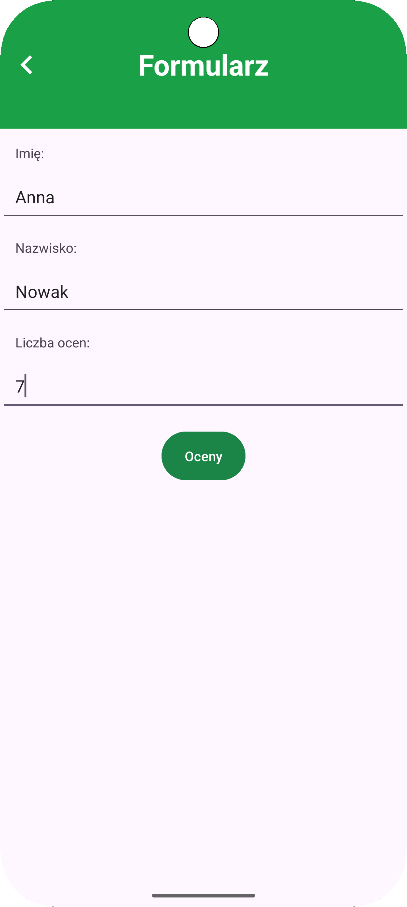
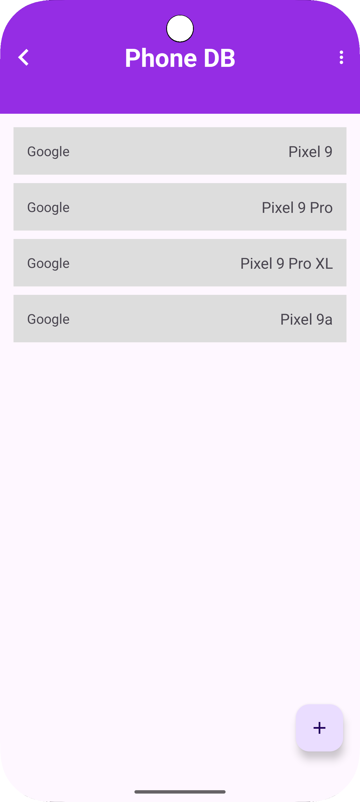
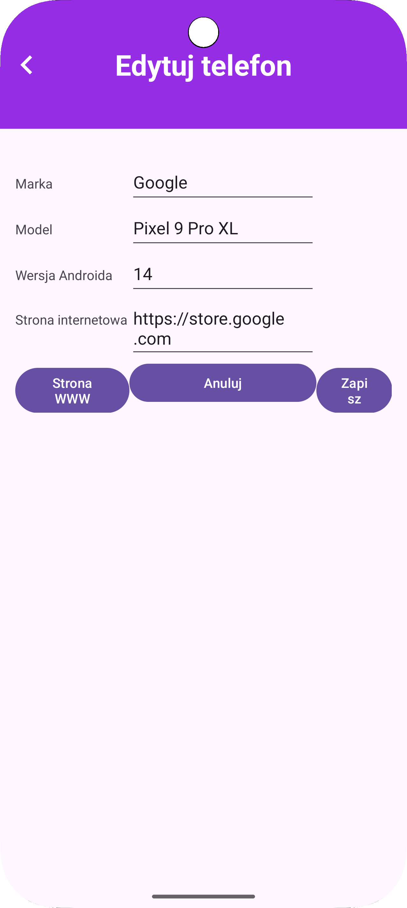
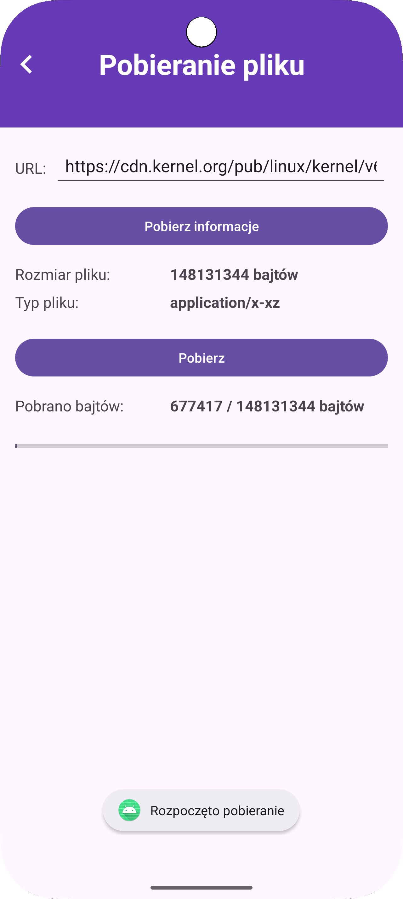
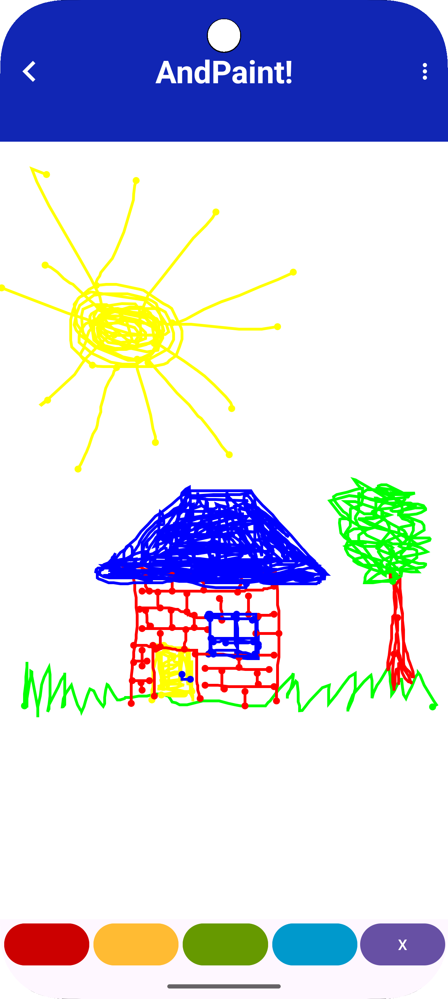
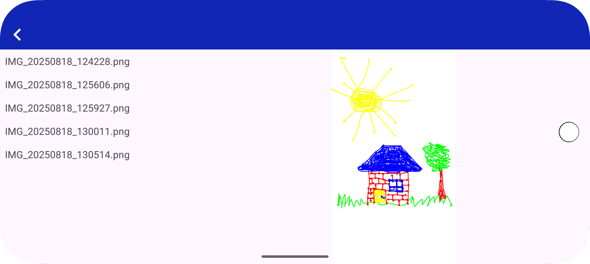
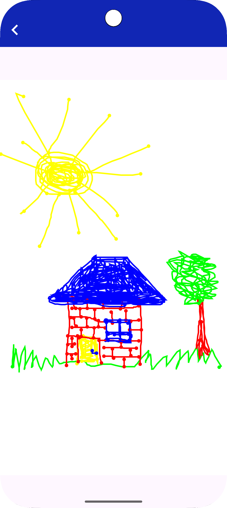

# Android Laboratory

**Android Laboratory** is a student project created as part of coursework at the Lublin University of Technology. It consists of four independent mobile applications written in Java using the Android SDK, demonstrating key aspects of Android programming, such as forms, databases, file downloading, and graphical drawing. The project serves solely as a portfolio of programming skills and is not intended for commercial use or redistribution. All rights reserved.

## Table of Contents
- [Features](#features)
    - [1. Student Form](#1-student-form)
    - [2. Phone DB](#2-phone-db)
    - [3. File Download](#3-file-download)
    - [4. AndPaint](#4-andpaint)
- [Interface Consistency](#interface-consistency)
- [Summary](#summary)
- [Running the Project](#running-the-project)
- [Screenshots](#screenshots)
- [GIFs](#gifs)
- [Permissions](#permissions)
- [Technologies and Libraries](#technologies-and-libraries)
- [Author](#author)

## Features

### 1. Student Form

This module allows entering student data and grades, calculating the average, and displaying a final message.

#### Main Features:
- **Input Validation:**
    - First name and last name cannot be empty.
    - The number of grades cannot be empty and must be in the range of 5 to 15.
    - Each subject must have a selected grade.
    - In case of invalid data:
        - Attempting to calculate the average without selecting all grades displays a Toast message with an error.
        - For empty or incorrectly filled form fields, error messages are displayed on the fields (`setError()`).
- **Dynamic Visibility of the "Grades" Button:**
    - The button appears only after all data is correctly entered.
- **Transition to the Grades View:**
    - The application dynamically creates a list of subjects with grade selection based on the previously entered number.
    - Subject names are retrieved from the `strings.xml` file.
    - Grades are selected using radio button groups, where the user selects one grade from 2 to 5 for each subject.
- **Average Calculation:**
    - After selecting grades for each subject, the user can calculate the average.
    - Pressing the button automatically returns to the main form view and:
        - Displays the average in a `TextView`,
        - Shows a button with a message depending on the result:
            - "Super :)" (if the average ≥ 3),
            - "This time it didn’t go well" (if the average < 3).
- **Program Termination:**
    - Clicking the final button displays a Toast with a message depending on the average:
        - "Congratulations! You passed!"
        - "I’m submitting a request for conditional passing."
    - The application then closes.
- **State Preservation on Screen Rotation:**
    - The application correctly preserves:
        - Entered data values,
        - Button visibility,
        - Selected subject grades,
        - The average and final message.
    - Handled using `onSaveInstanceState()` / `onRestoreInstanceState()`.

#### Architecture and Components
- `StudentFormActivity.java` – Main screen with the student form.
- `GradesActivity.java` – Screen with the list of subjects, calculates the average based on selected grades.
- `activity_student_form2.xml` – Form layout with `EditText` fields, buttons, and a `TextView` for the average.
- `activity_grades.xml` – Grades screen layout with a `LinearLayout` to which `TextView` and `RadioGroup` are dynamically added.

### 2. Phone DB

This module manages a list of phones in a Room database, using the MVVM architecture.

#### Main Features:
- **Displaying the Phone List:**
    - The list is presented in a `RecyclerView`, showing the phone brand and model name.
    - Data is sorted lexicographically by model name (uppercase letters are displayed before lowercase).
    - The list updates in real-time using `LiveData` observation.
    - `DiffUtil` is used to handle list changes, enabling smooth animations for adding, editing, or deleting items instead of reloading the entire list.
- **Adding a New Phone:**
    - A floating `+` button opens an empty form for adding a new phone.
    - The form requires:
        - Brand,
        - Model,
        - Android version,
        - Manufacturer’s website URL.
    - Attempting to save incomplete data displays an appropriate message next to the field.
- **Editing an Existing Phone:**
    - Clicking a list item opens a form view with pre-filled phone data.
    - The user can edit the data and save changes or cancel the operation.
    - Attempting to save incomplete data displays an appropriate message next to the field.
- **Form Button Handling:**
    - `Website` – Opens the browser with the URL provided in the form (if it doesn’t start with `http`, the app adds it automatically).
    - `Save` – Saves the data to the database if the fields are not empty.
    - `Cancel` – Returns to the list without saving.
- **Deleting Phones:**
    - List items can be deleted by swiping sideways (Swipe to delete).
    - A main menu option, "Clear all data," deletes all records from the database.
- **Default Data on First Launch:**
    - The database is populated with sample Pixel 9 models (various variants) on the first app launch.
- **State Preservation on Screen Rotation:**
    - The form and data remain unchanged after rotation thanks to the local database and MVVM architecture.

#### Architecture and Components
- `AddPhoneActivity.java` – Screen for entering new phone data and returning it to the previous activity.
- `DatabaseActivity.java` – Main activity managing the display, addition, editing, and deletion of phones in the database.
- `EditPhoneActivity.java` – Screen for editing an existing phone and saving changes to the database.
- `PhoneDao.java` – Interface defining CRUD operations on the `phone_table` in the Room database.
- `PhoneRoomDatabase.java` – Singleton managing the Room database instance and configuration.
- `PhoneRepository.java` – Layer mediating between the database and ViewModel, performing operations in the background.
- `PhoneViewModel.java` – Provides data to the UI and delegates CRUD operations to the repository.
- `PhoneListAdapter.java` – `RecyclerView` adapter displaying the phone list and handling clicks.
- `Phone.java` – Entity representing a phone with fields: id, name, brand, Android version, and website.
- `activity_addphone.xml` – Layout for the phone addition form.
- `activity_database.xml` – Main layout with the phone list and add button.
- `activity_editphone.xml` – Layout for the phone editing form.
- `phone_item.xml` – Layout for a single phone list item in the RecyclerView.

### 3. File Download

This module downloads files from the internet with a progress preview, running in the background.

#### Main Features:
- **User Interface:**
    - A text field for entering the file URL (requires `https://`), pre-filled with a sample address.
    - **"Get Info"** Button:
        - Sends an asynchronous background request for file metadata,
        - Displays the file size in bytes,
        - Displays the MIME type or a question mark if it cannot be determined.
    - **"Download"** Button:
        - Initiates the file download from the provided URL,
        - Checks required permissions and requests them dynamically if needed.
    - Progress View:
        - A progress bar updated in real-time,
        - Text showing the number of downloaded bytes relative to the total file size.
- **Permission Handling:**
    - Dynamic permission requests (device storage write, notifications – depending on the Android version).
    - Displays a Toast message informing about the need to grant permissions.
    - Handles permission denial and displays an appropriate error message.
- **Background Downloading and UI Communication:**
    - Uses the `DownloadService` running independently of the activity.
    - Connects the activity to the service via `ServiceConnection` and observes download state changes using `LiveData`.
    - The user interface responds instantly to download progress changes.
    - The process continues in the background even after closing the activity.
- **System Notifications:**
    - **During Download**: A foreground notification with a dynamically updated progress bar.
    - **On Success**: Notification about saving the file to the device’s storage.
    - **On Error**: Notification about download failure.
- **State Preservation on Screen Rotation:**
    - File information and download state (downloaded bytes, total size, current status) are saved and restored after screen rotation.
    - The download process is not interrupted during device configuration changes.

#### Architecture and Components
- `FileDownloadActivity.java` – Main activity handling the user interface, file metadata retrieval, and communication with the service.
- `DownloadService.java` – Background service responsible for actual file downloading and progress reporting.
- `ProgressEvent.java` – Class representing download state data (current progress, total size, status).
- `ShortTask.java` – Asynchronous task retrieving file metadata (size, MIME type).
- `FileInfo.java` – Model storing file information.
- `activity_filedownload.xml` – Main module screen layout with text fields, buttons, and a progress bar.

### 4. AndPaint

This module allows drawing with a selected paint color, saving, and browsing images.

#### Main Features:
- **Drawing Area:**
    - The `DrawingSurface` component handles user touch input (`onTouchEvent()` method).
    - Lines are drawn directly on a bitmap created during the `surfaceCreated()` event (sized to match the component).
    - Each line includes:
        - The actual stroke,
        - A circle at the start and end of the line (drawn using the `drawCircle()` method).
    - All drawings are added to a single shared bitmap in memory.
    - After each drawing change, the `invalidate()` method is called, triggering a redraw in `onDraw()`.
- **Brush Color Selection:**
    - Available colors: red, yellow, green, blue.
    - Colors are selected via buttons with the `android:backgroundTint` attribute set to the appropriate color (`@android:color/holo_*`).
    - Buttons have equal width (19% of the screen) and are arranged in a horizontal `Chain` (ConstraintLayout constraint chain).
- **Clearing the Drawing:**
    - A button with an "X" icon clears the entire bitmap content.
    - Pressing it creates a new, blank bitmap, and the `DrawingSurface` is refreshed.
- **Saving the Image:**
    - The app menu includes a "Save Image" option.
    - On click:
        - A graphic file (.png) is created,
        - The drawing from the bitmap is saved to the disk,
        - The file name is dynamically generated (with a timestamp),
        - The app checks and requests storage permissions if needed,
        - A `Toast` appears with confirmation and the file name.
- **Browsing Saved Images:**
    - The "Browse Images" menu option opens a new `BrowseActivity`.
    - Depending on screen orientation:
        - **Vertical**: Displays only the `ImageListFragment` (list of graphic files).
        - **Horizontal**: The screen splits into two fragments: the list on the left (`ImageListFragment`) and the preview on the right (`ImageFragment`).
    - Clicking a list item:
        - In **vertical** orientation: Opens `ViewActivity`, which contains `ImageFragment` to display the image.
        - In **horizontal** orientation: Updates the image in `ImageFragment`.
    - Images are loaded from the app’s local folder via `MediaStore`.
- **State Preservation:**
    - The drawing is preserved after screen rotation but may not fully match the new orientation, causing partial cropping. Returning to the original orientation restores full visibility.
    - Fragments and the image browser work correctly in both orientations.
- **Permissions:**
    - The app checks required permissions for file storage (`WRITE_EXTERNAL_STORAGE` for Android < 10), considering the Android version.
    - If permission is denied, a dialog prompts the user to grant it.

#### Architecture and Components
- `DrawingSurface.java` – Custom `SurfaceView` component handling line drawing, brush color changes, and screen clearing.
- `DrawingActivity.java` – Main module activity with color selection buttons, clear button, and menu for saving and browsing images.
- `BrowseActivity.java` – Image browser activity, displaying the list (`ImageListFragment`) in vertical orientation and both list and preview (`ImageFragment`) in horizontal orientation.
- `ViewActivity.java` – Activity for full-screen display of a single image.
- `ImageListFragment.java` – Fragment presenting a list of saved images from `MediaStore`.
- `ImageFragment.java` – Fragment displaying an image based on its ID.
- `ImageAdapter.java` – `RecyclerView` adapter handling the image list.
- `Image.java` – Image model class (ID, name).
- `activity_drawing.xml` – Main drawing screen layout.
- `activity_browse.xml` – Image browsing screen layout (list + preview in horizontal orientation).
- `activity_view.xml` – Single image display screen layout.
- `fragment_image_list.xml` – Image list layout.
- `fragment_image.xml` – Image preview layout.
- `item_image.xml` – Layout for a single image list item.

## Interface Consistency
- **Responsive Layout:**
    - All modules use `ConstraintLayout`.
    - Both vertical and horizontal orientations are supported.
- **Text and Colors:**
    - All strings are stored in `strings.xml`.
    - Module header colors are defined in `colors.xml`.
- **Module Header:**
    - Each module has a `TextView` serving as a header.
    - Headers have consistent font size, text color, and background.
- **Toolbar:**
    - Each activity has a `Toolbar` with a title and a back button.
- **Buttons and Interactive Elements:**
    - Buttons have a consistent style (`OvalButton` or standard).
    - FloatingActionButton is used in modules with lists (e.g., phone database).
- **Scrollability:**
    - ScrollView/NestedScrollView is used in modules requiring content scrolling.

## Summary
The project includes four modules, each demonstrating different aspects of Android programming:
1. **Student Form:** Dynamic forms with validation and state management.
2. **Phone DB:** Local database with CRUD interface in MVVM architecture.
3. **File Download:** Background downloading with notifications and dynamic permissions.
4. **AndPaint:** Graphical drawing and responsive image browsing.

## Running the Project
1. Clone the repository: `git clone https://github.com/Margriell/Android_laboratoria`.
2. Open in Android Studio (2023.3.1+).
3. Install Android SDK (API 24+).
4. Sync Gradle (`Sync Project with Gradle Files`).
5. Run on an emulator/device (Android 7.0+).
6. Source code is located in `app/src/main/java/com/example/laboratorium_and/`, and resources in `app/src/main/res/`.
7. Issues:
    - Perform `Build > Clean Project` and `Build > Rebuild Project`.
    - Check dependencies in `build.gradle`.

The main menu allows selecting a module.

## Screenshots

### Student Form

   
  <em>Student data entry screen</em>

   
  <em>Dynamic list of subjects with grades</em>

### Phone DB

   
  <em>Phone list in RecyclerView</em>

   
  <em>New phone addition form</em>

   
  <em>Existing phone editing form</em>

### File Download

   
  <em>File download screen</em>

### AndPaint

   
  <em>Drawing screen in AndPaint</em>

   
  <em>Image browsing in horizontal orientation</em>

   
  <em>Image list in vertical orientation</em>

   
  <em>Image preview in vertical orientation</em>

## GIFs

Below are animations showcasing the functionality of individual app modules:

### Student Form

   
  <em>Animation showing data entry and average calculation in the Student Form module</em>

### Phone DB

   
  <em>Animation showing phone addition and browsing in the Phone DB module</em>

### File Download

   
  <em>Animation showing the file download process with progress preview</em>

### AndPaint

   
  <em>Animation showing drawing and image browsing in vertical orientation using fragments</em>

   
  <em>Animation showing image browsing in horizontal orientation with list and preview fragments</em>

## Permissions
- **Student Form:**
    - No external permissions; operations are fully local (app memory).
- **Phone DB:**
    - No external permissions; operations are fully local (Room database, app memory).
- **File Download:**
    - `INTERNET` – Access to network downloads (declared in the manifest).
    - `WRITE_EXTERNAL_STORAGE` – File storage write (Android < 10, with dynamic consent).
    - `POST_NOTIFICATIONS` – Notifications (Android 13+, dynamic consent).
- **AndPaint:**
    - `WRITE_EXTERNAL_STORAGE` – Image storage write (Android < 10, with dynamic consent).
    - On Android 10+, image saving and reading in `MediaStore` without additional permissions.

## Technologies and Libraries
- **Language:** Java
- **Android SDK:** UI, components, services
- **Room:** Database (DAO, repository)
- **LiveData, ViewModel:** Data observation, state
- **RecyclerView:** Lists
- **ConstraintLayout, LinearLayout, ScrollView:** Layouts
- **SurfaceView:** Drawing
- **ShortTask:** Custom asynchronous task for retrieving metadata
- **ExecutorService, Handler:** Asynchronous background operations
- **Notifications:** Download progress
- **Toast, setError:** Messages and validation

## Author
- **Name:** Małgorzata Pytyś
- **GitHub:** [github.com/Margriell](https://github.com/Margriell)
- **E-mail:** [malgorzatapytys@gmail.com](mailto:malgorzatapytys@gmail.com)