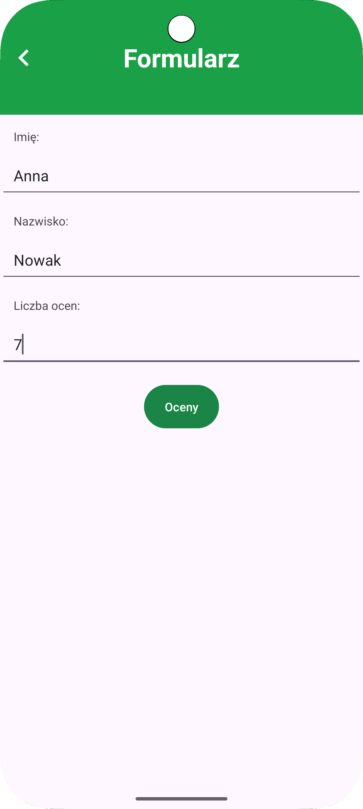
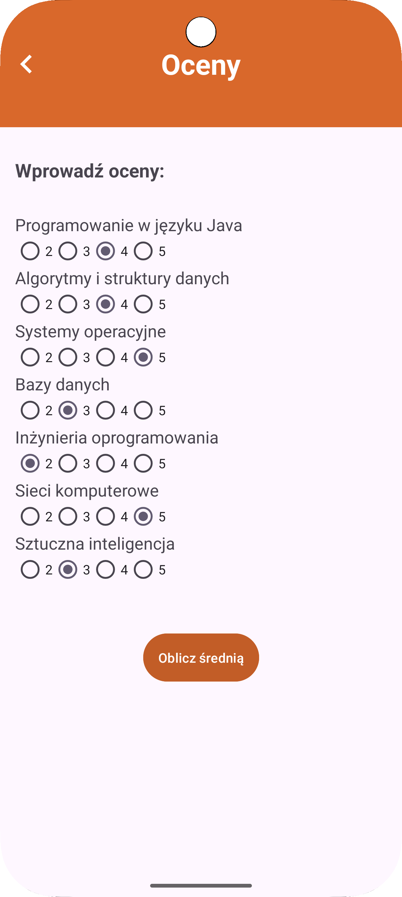
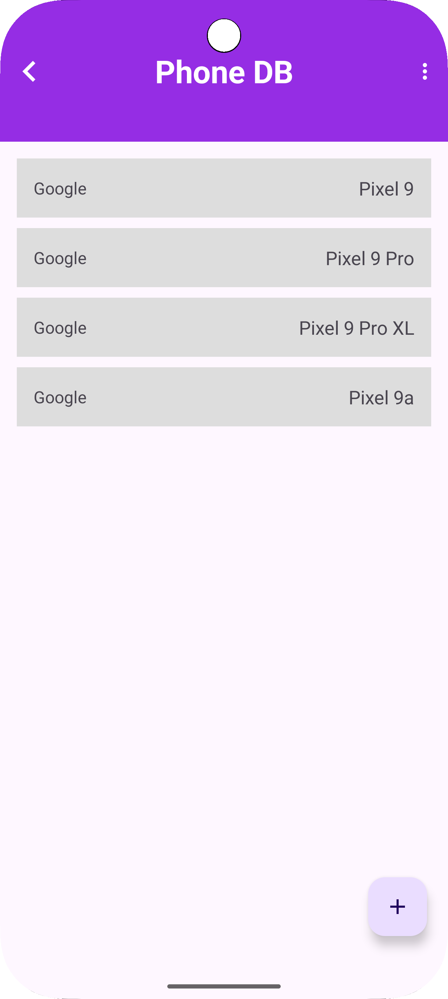
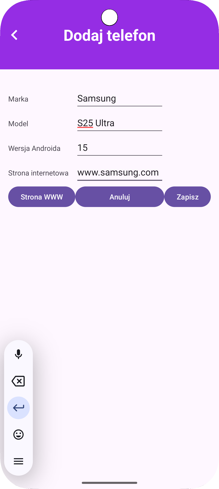
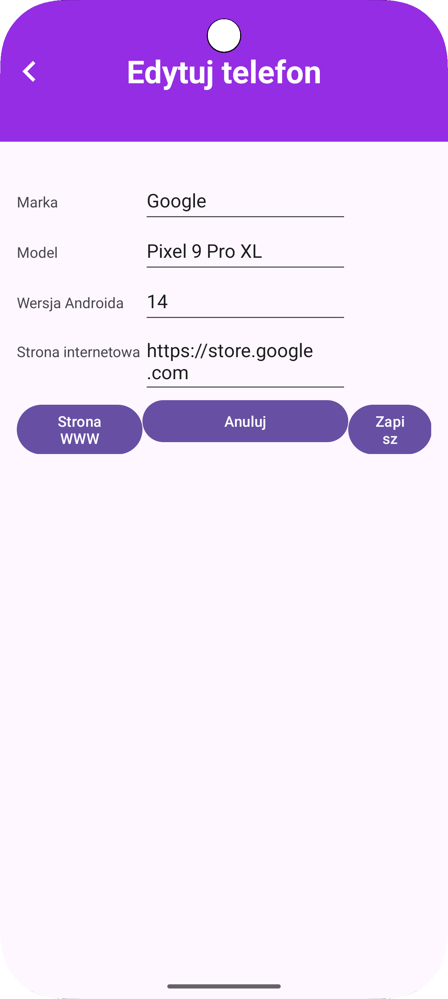
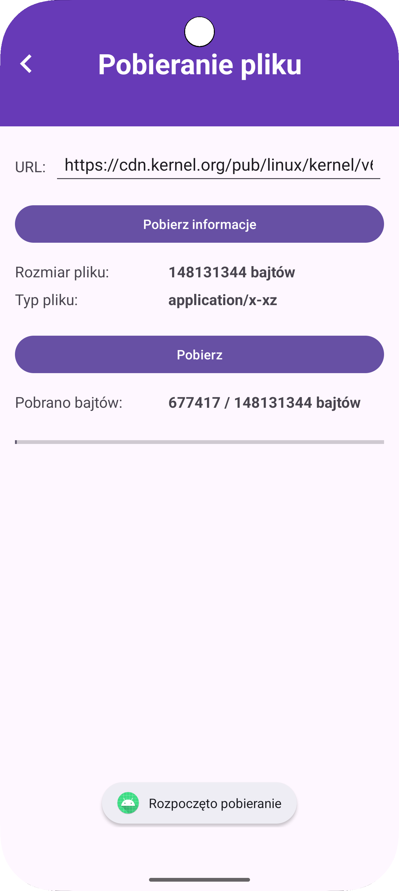
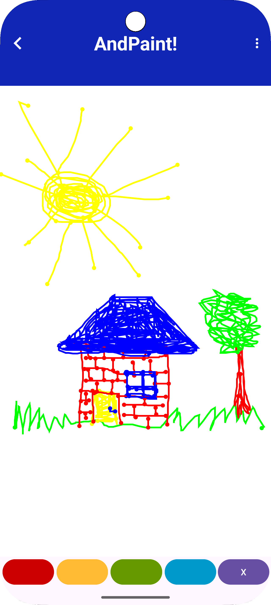
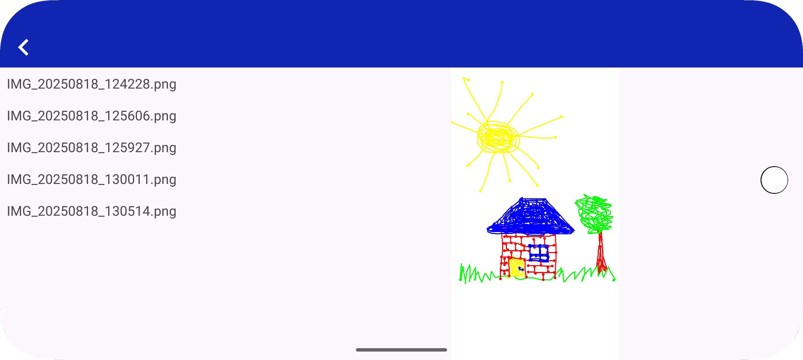
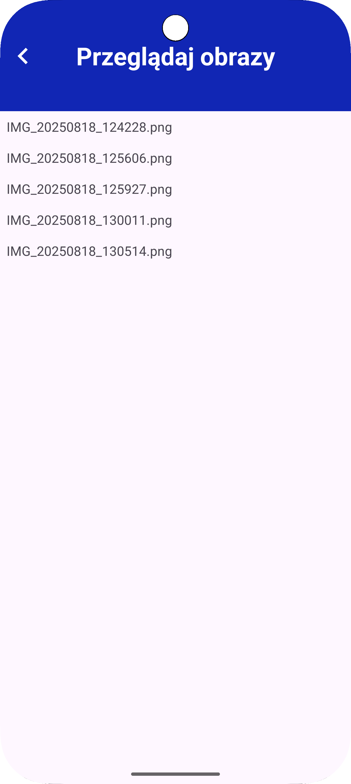
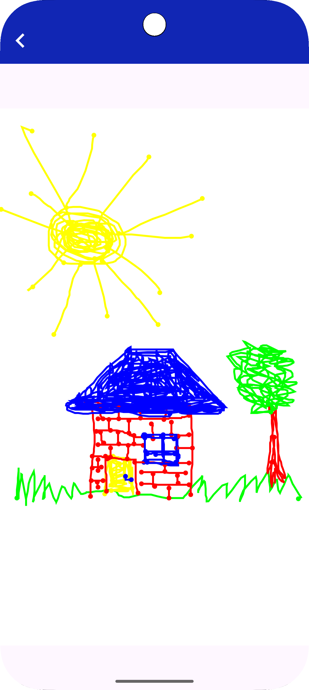

# Laboratorium Android

**Laboratorium Android** to projekt studencki stworzony w ramach zajęć na Politechnice Lubelskiej. Składa się z czterech niezależnych aplikacji mobilnych napisanych w języku Java z użyciem Android SDK, demonstrujących kluczowe aspekty programowania na Androida, takie jak formularze, bazy danych, pobieranie plików i rysowanie graficzne. Projekt służy wyłącznie jako portfolio umiejętności programistycznych i nie jest przeznaczony do użytku komercyjnego ani ponownego wykorzystania. Wszelkie prawa zastrzeżone.

## Spis treści
- [Funkcjonalności](#funkcjonalności)
    - [1. Formularz Studenta](#1-formularz-studenta)
    - [2. Phone DB](#2-phone-db)
    - [3. Pobieranie Pliku](#3-pobieranie-pliku)
    - [4. AndPaint](#4-andpaint)
- [Spójność interfejsu](#spójność-interfejsu)
- [Podsumowanie](#podsumowanie)
- [Uruchomienie](#uruchomienie)
- [Zrzuty ekranu](#zrzuty-ekranu)
- [Uprawnienia](#uprawnienia)
- [Technologie i biblioteki](#technologie-i-biblioteki)
- [Autor](#autor)

## Funkcjonalności

### 1. Formularz Studenta

Moduł umożliwia wprowadzenie danych studenta i ocen, obliczenie średniej oraz wyświetlenie komunikatu końcowego.

#### Główne funkcjonalności:
- **Walidacja danych wejściowych:**
    - Imię i nazwisko nie mogą być puste.
    - Liczba ocen nie może być pusta i musi mieścić się w przedziale od 5 do 15.
    - Każdy z przedmiotów musi mieć zaznaczone pole z oceną.
    - W przypadku nieprawidłowych danych:
        - Przy próbie obliczenia średniej bez zaznaczenia wszystkich ocen wyświetlany jest komunikat Toast z informacją o błędzie.
        - W przypadku pustych lub niepoprawnie wypełnionych pól formularza wyświetlane są komunikaty błędów na polach (`setError()`).
- **Dynamiczna widoczność przycisku "Oceny":**
    - Przycisk pojawia się dopiero po wprowadzeniu wszystkich danych w poprawny sposób.
- **Przejście do widoku ocen:**
    - Aplikacja tworzy dynamicznie listę przedmiotów z możliwością wyboru ocen zgodnie z podaną wcześniej liczbą.
    - Nazwy przedmiotów pobierane są z pliku `strings.xml`.
    - Oceny wybierane są za pomocą grup przycisków, gdzie użytkownik zaznacza jedną ocenę od 2 do 5 dla każdego przedmiotu.
- **Obliczanie średniej:**
    - Po zaznaczeniu ocen dla każdego przedmiotu użytkownik może obliczyć średnią.
    - Naciśnięcie przycisku powoduje automatyczny powrót do głównego widoku z formularzem oraz:
        - wyświetlenie średniej w `TextView`,
        - pojawienie się przycisku z zależnym od wyniku komunikatem:
            - „Super :)” (jeśli średnia ≥ 3),
            - „Tym razem mi nie poszło” (jeśli średnia < 3).
- **Zakończenie programu:**
    - Po kliknięciu przycisku końcowego aplikacja wyświetla Toast z odpowiednim komunikatem (zależnym od uzyskanej średniej):
        - „Gratulacje! Otrzymujesz zaliczenie!”
        - „Wysyłam podanie o zaliczenie warunkowe”
    - Aplikacja zostaje następnie zamknięta.
- **Zachowanie stanu przy obrocie ekranu:**
    - Aplikacja poprawnie zachowuje:
        - wartości wprowadzonych danych,
        - widoczność przycisków,
        - wybraną liczbę ocen i zaznaczone oceny,
        - średnią oraz komunikat końcowy.
    - Obsługa oparta jest na `onSaveInstanceState()` / `onRestoreInstanceState()`.

#### Architektura i komponenty
- `StudentFormActivity.java` – ekran główny z formularzem studenta.
- `GradesActivity.java` – ekran z listą przedmiotów, oblicza średnią na podstawie wybranych ocen.
- `activity_student_form2.xml` – layout formularza z polami `EditText`, przyciskami i `TextView` na średnią.
- `activity_grades.xml` – layout ekranu ocen z `LinearLayout`, do którego dynamicznie dodawane są `TextView` i `RadioGroup`.

### 2. Phone DB

Moduł zarządza listą telefonów w bazie Room, z architekturą MVVM.

#### Główne funkcjonalności:
- **Wyświetlanie listy telefonów:**
    - Lista prezentowana jest w postaci `RecyclerView`, zawierającego markę telefonu i nazwę modelu.
    - Dane są sortowane leksykograficznie po nazwie modelu (duże litery wyświetlane są przed małymi).
    - Lista aktualizuje się w czasie rzeczywistym dzięki obserwacji `LiveData`.
    - Do obsługi zmian w liście zastosowano `DiffUtil`, dzięki czemu przy dodawaniu, edycji czy usuwaniu elementów wyświetlane są płynne animacje zamiast pełnego przeładowania listy.
- **Dodawanie nowego telefonu:**
    - Dostępny jest pływający przycisk `+`, który otwiera pusty formularz umożliwiający dodanie nowego telefonu.
    - W formularzu należy uzupełnić:
        - markę,
        - model,
        - wersję Androida,
        - adres strony WWW producenta.
    - Przy próbie zapisania niepełnych danych wyświetlany jest odpowiedni komunikat obok pola.
- **Edycja istniejącego telefonu:**
    - Kliknięcie na pozycję w liście otwiera widok formularza z uzupełnionymi danymi danego telefonu.
    - Użytkownik może edytować dane i zapisać zmiany lub anulować operację.
    - Przy próbie zapisania niepełnych danych wyświetlany jest odpowiedni komunikat obok pola.
- **Obsługa przycisków formularza:**
    - `Strona WWW` – otwiera przeglądarkę z adresem podanym w formularzu (jeśli nie zaczyna się od `http`, aplikacja dodaje go automatycznie).
    - `Zapisz` – zapisuje dane do bazy jeśli pola nie są puste.
    - `Anuluj` – wraca do listy bez zapisu.
- **Usuwanie telefonów:**
    - Elementy listy mogą być usuwane przez gest przeciągnięcia w bok (Swipe to delete).
    - Dostępna jest również opcja z menu głównego `Wyczyść wszystkie dane`, która usuwa wszystkie rekordy z bazy.
- **Dane domyślne przy pierwszym uruchomieniu:**
    - Baza danych wypełniana jest przykładowymi modelami Pixel 9 (różne warianty) podczas pierwszego uruchomienia aplikacji.
- **Zachowanie stanu przy obrocie ekranu:**
    - Formularz i dane pozostają niezmienione po obrocie dzięki pracy z lokalną bazą danych oraz architekturze MVVM.

#### Architektura i komponenty
- `AddPhoneActivity.java` – ekran pozwalający wprowadzić dane nowego telefonu i zwrócić je do poprzedniej aktywności.
- `DatabaseActivity.java` – główna aktywność zarządzająca wyświetlaniem, dodawaniem, edytowaniem oraz usuwaniem telefonów w bazie danych.
- `EditPhoneActivity.java` – ekran umożliwiający edycję istniejącego telefonu oraz zapisanie zmian do bazy danych.
- `PhoneDao.java` – interfejs definiujący operacje CRUD na tabeli `phone_table` w bazie Room.
- `PhoneRoomDatabase.java` – singleton zarządzający instancją i konfiguracją bazy danych Room.
- `PhoneRepository.java` – warstwa pośrednicząca między bazą danych a ViewModel, wykonująca operacje w tle.
- `PhoneViewModel.java` – udostępnia dane do UI i deleguje operacje CRUD do repozytorium.
- `PhoneListAdapter.java` – adapter `RecyclerView` wyświetlający listę telefonów i obsługujący kliknięcia.
- `Phone.java` – encja reprezentująca telefon z polami: id, nazwa, marka, wersja Androida i strona WWW.
- `activity_addphone.xml` – layout formularza dodawania telefonu.
- `activity_database.xml` – główny layout z listą telefonów i przyciskiem dodawania.
- `activity_editphone.xml` – layout formularza edycji telefonu.
- `phone_item.xml` – layout pojedynczego elementu listy telefonów w RecyclerView.

### 3. Pobieranie Pliku

Moduł pobiera pliki z Internetu z podglądem postępu, działając w tle.

#### Główne funkcjonalności:
- **Interfejs użytkownika:**
    - Pole tekstowe do wprowadzenia adresu URL pliku (wymagane `https://`), wstępnie uzupełnione przykładowym adresem.
    - Przycisk **„Pobierz informacje”**:
        - Wysyła asynchroniczne zapytanie w tle o metadane pliku,
        - Wyświetla rozmiar pliku w bajtach,
        - Wyświetla typ MIME lub znak zapytania, jeśli nie jest możliwe jego określenie.
    - Przycisk **„Pobierz”**:
        - Inicjuje proces pobierania pliku z podanego URL,
        - Sprawdza wymagane uprawnienia i w razie potrzeby prosi o nie dynamicznie.
    - Widok postępu:
        - Pasek postępu aktualizowany na bieżąco,
        - Tekst prezentujący liczbę pobranych bajtów względem całkowitego rozmiaru pliku.
- **Obsługa uprawnień:**
    - Dynamiczne żądanie uprawnień (zapisu na urządzeniu, powiadomień – zależnie od wersji Androida).
    - Wyświetlanie komunikatu Toast z informacją o konieczności ich przyznania.
    - Obsługa odmowy udzielenia zgody i wyświetlanie stosownego komunikatu błędu.
- **Pobieranie w tle i komunikacja z UI:**
    - Wykorzystanie usługi `DownloadService` działającej niezależnie od aktywności.
    - Połączenie aktywności z usługą poprzez `ServiceConnection` i obserwowanie zmian stanu pobierania przy użyciu `LiveData`.
    - Interfejs użytkownika reaguje natychmiast na zmiany postępu pobierania.
    - Proces działa w tle nawet po zamknięciu lub obróceniu aktywności.
- **Powiadomienia systemowe:**
    - **Podczas pobierania**: powiadomienie w trybie pierwszoplanowym z dynamicznie aktualizowanym paskiem postępu.
    - **Po zakończeniu sukcesem**: informacja o zapisaniu pliku w pamięci urządzenia.
    - **W przypadku błędu**: komunikat o niepowodzeniu pobierania.
- **Zachowanie stanu przy zmianie orientacji:**
    - Stan pobierania (liczba pobranych bajtów, całkowity rozmiar, aktualny status) jest zapisywany i odtwarzany po obrocie ekranu.
    - Proces pobierania nie jest przerywany w trakcie zmiany konfiguracji urządzenia.

#### Architektura i komponenty
- `FileDownloadActivity.java` – główna aktywność obsługująca interfejs użytkownika, pobieranie informacji o pliku oraz komunikację z usługą.
- `DownloadService.java` – usługa działająca w tle, odpowiedzialna za faktyczne pobieranie pliku i raportowanie postępu.
- `ProgressEvent.java` – klasa reprezentująca dane o stanie pobierania (aktualny postęp, całkowity rozmiar, status).
- `ShortTask.java` – zadanie asynchroniczne pobierające metadane pliku (rozmiar, typ MIME).
- `FileInfo.java` – model przechowujący informacje o pliku.
- `activity_filedownload.xml` – layout głównego ekranu modułu z polami tekstowymi, przyciskami oraz paskiem postępu.

### 4. AndPaint

Moduł umożliwia rysowanie wybranym kolorem farby, zapis i przeglądanie obrazów.

#### Główne funkcjonalności:
- **Pole do rysowania:**
    - Komponent `DrawingSurface` obsługuje dotyk użytkownika (metoda `onTouchEvent()`).
    - Linie rysowane są bezpośrednio na bitmapie utworzonej w momencie zdarzenia `surfaceCreated()` (dopasowanej rozmiarem do komponentu).
    - Każda linia zawiera:
        - właściwą kreskę,
        - kółko na początku i końcu linii (rysowane z użyciem metody `drawCircle()`).
    - Wszystkie rysunki dodawane są do jednej wspólnej bitmapy w pamięci.
    - Po każdej zmianie rysunku wywoływana jest metoda `invalidate()`, która powoduje ponowne narysowanie komponentu w `onDraw()`.
- **Wybór koloru pędzla:**
    - Dostępne kolory: czerwony, żółty, zielony, niebieski.
    - Kolory wybierane są przyciskami, z atrybutem `android:backgroundTint` ustawionym na odpowiedni kolor (`@android:color/holo_*`).
    - Przyciski mają równą szerokość (19% ekranu) i są ułożone w poziomym `Chain` (łańcuch ograniczeń w ConstraintLayout).
- **Czyszczenie rysunku:**
    - Przycisk z ikoną "X" pozwala na usunięcie całej zawartości bitmapy.
    - Po naciśnięciu tworzy się nowa, czysta bitmapa, a `DrawingSurface` zostaje odświeżony.
- **Zapis obrazu:**
    - Menu aplikacji zawiera opcję „Zapisz obraz”.
    - Po kliknięciu:
        - tworzony jest plik graficzny,
        - rysunek z bitmapy zapisywany jest na dysku,
        - nazwa pliku generowana dynamicznie (np. z timestampem),
        - aplikacja sprawdza i ewentualnie prosi o uprawnienia do zapisu,
        - pojawia się `Toast` z potwierdzeniem i nazwą pliku.
- **Przeglądanie zapisanych obrazów:**
    - Opcja „Przeglądaj obrazy” w menu otwiera nową aktywność `BrowseActivity`.
    - W zależności od orientacji ekranu:
        - **Pionowo** – wyświetlany jest tylko `ImageListFragment` (lista plików graficznych).
        - **Poziomo** – ekran dzieli się na dwa fragmenty: lista po lewej (`ImageListFragment`) i podgląd po prawej (`ImageFragment`).
    - Kliknięcie pozycji na liście:
        - w **poziomie** – podmienia obraz w `ImageFragment`,
        - w **pionie** – otwiera `ViewActivity`, która zawiera `ImageFragment` z wyświetleniem obrazu.
    - Obrazy ładowane są z lokalnego folderu aplikacji poprzez `MediaStore`.
- **Zachowanie stanu:**
    - Rysunek jest zachowywany po obrocie ekranu, ale może ulec niedopasowaniu rozmiaru do nowej orientacji, co powoduje częściowe ucięcie obrazu. Po powrocie do początkowej orientacji rysunek jest w pełni widoczny.
    - Fragmenty i przeglądarka obrazów działają poprawnie w obu orientacjach.
- **Uprawnienia:**
    - Aplikacja sprawdza wymagane uprawnienia do zapisu plików (`WRITE_EXTERNAL_STORAGE` dla Androida < 10) z uwzględnieniem wersji systemu Android.
    - Jeśli brak zgody — pojawia się dialog proszący o nadanie uprawnień.

#### Architektura i komponenty
- `DrawingSurface.java` – niestandardowy komponent `SurfaceView` obsługujący rysowanie linii, zmianę koloru pędzla i czyszczenie ekranu.
- `DrawingActivity.java` – główna aktywność modułu z przyciskami wyboru koloru, czyszczenia oraz menu do zapisu i przeglądania obrazów.
- `BrowseActivity.java` – aktywność przeglądarki obrazów, w pionie wyświetla listę (`ImageListFragment`), w poziomie listę i podgląd (`ImageFragment`).
- `ViewActivity.java` – aktywność do pełnoekranowego wyświetlania pojedynczego obrazu.
- `ImageListFragment.java` – fragment prezentujący listę zapisanych obrazów z `MediaStore`.
- `ImageFragment.java` – fragment wyświetlający obraz na podstawie ID.
- `ImageAdapter.java` – adapter `RecyclerView` obsługujący listę obrazów.
- `Image.java` – klasa modelu obrazu (ID, nazwa).
- `activity_drawing.xml` – layout głównego ekranu rysowania.
- `activity_browse.xml` – layout ekranu przeglądania obrazów (lista + podgląd w poziomie).
- `activity_view.xml` – layout ekranu wyświetlania pojedynczego obrazu.
- `fragment_image_list.xml` – layout listy obrazów.
- `fragment_image.xml` – layout podglądu obrazu.
- `item_image.xml` – layout elementu listy obrazów.

## Spójność interfejsu
- **Układ responsywny:**
    - Wszystkie moduły korzystają z `ConstraintLayout`.
    - Obsługiwana jest zarówno orientacja pionowa, jak i pozioma.
- **Teksty i kolory:**
    - Wszystkie napisy znajdują się w `strings.xml`.
    - Kolory nagłówków modułów zdefiniowane w `colors.xml`.
- **Nagłówek modułu:**
    - Każdy moduł ma `TextView` pełniący rolę nagłówka.
    - Nagłówek ma spójny rozmiar czcionki, kolor tekstu i tło.
- **Toolbar:**
    - Każda aktywność posiada `Toolbar` z tytułem i przyciskiem powrotu.
- **Przyciski i elementy interaktywne:**
    - Przyciski mają spójny styl (`OvalButton` lub standardowy).
    - FloatingActionButton stosowany w module z listą elementów (np. baza telefonów).
- **Przewijalność:**
    - ScrollView/NestedScrollView użyty w modułach, które wymagają przewijania treści.

## Podsumowanie
Projekt obejmuje cztery moduły, z których każdy demonstruje inne aspekty programowania na Androida:
1. **Formularz Studenta:** Dynamiczne formularze z walidacją i zarządzaniem stanem.
2. **Phone DB:** Lokalna baza danych z interfejsem CRUD w architekturze MVVM.
3. **Pobieranie Pliku:** Pobieranie w tle z powiadomieniami i dynamicznymi uprawnieniami.
4. **AndPaint:** Rysowanie graficzne i responsywne przeglądanie obrazów.

## Uruchomienie
1. Sklonuj repozytorium: `git clone https://github.com/Margriell/Android_laboratoria`.
2. Otwórz w Android Studio (2023.3.1+).
3. Zainstaluj Android SDK (API 24+).
4. Zsynchronizuj Gradle (`Sync Project with Gradle Files`).
5. Uruchom na emulatorze/urządzeniu (Android 7.0+).
6. Kod źródłowy znajduje się w `app/src/main/java/com/example/laboratorium_and/`, a zasoby w `app/src/main/res/`.
7. Problemy:
    - Wykonaj `Build > Clean Project` i `Build > Rebuild Project`.
    - Sprawdź zależności w `build.gradle`.

Menu główne umożliwia wybór modułu.

## Zrzuty ekranu

### Formularz Studenta
- 
- 

### Phone DB
- 
- 
- 

### Pobieranie Pliku
- 

### AndPaint
- 
- 
- 
- 

## Uprawnienia
- **Formularz Studenta:**
    - Brak uprawnień zewnętrznych, operacje w pełni lokalne (pamięć aplikacji).
- **Phone DB:**
    - Brak uprawnień zewnętrznych, operacje w pełni lokalne (baza Room, pamięć aplikacji).
- **Pobieranie Pliku:**
    - `INTERNET` – dostęp do pobierania z sieci (zadeklarowane w manifeście).
    - `WRITE_EXTERNAL_STORAGE` – zapis pliku na urządzeniu (Android < 10, z dynamiczną zgodą).
    - `POST_NOTIFICATIONS` – powiadomienia (Android 13+, dynamiczna zgoda).
- **AndPaint:**
    - `WRITE_EXTERNAL_STORAGE` – zapis obrazów (Android < 10, z dynamiczną zgodą).
    - Na Androidzie 10+ zapis i odczyt obrazów w `MediaStore` bez dodatkowych uprawnień.

## Technologie i biblioteki
- **Język:** Java
- **Android SDK:** UI, komponenty, usługi
- **Room:** Baza danych (DAO, repozytorium)
- **LiveData, ViewModel:** Obserwacja danych, stan
- **RecyclerView:** Listy
- **ConstraintLayout, LinearLayout, ScrollView:** Układy
- **SurfaceView:** Rysowanie
- **ShortTask:** Niestandardowe zadanie asynchroniczne do pobierania metadanych
- **ExecutorService, Handler:** Asynchroniczne operacje w tle
- **Powiadomienia:** Postęp pobierania
- **Toast, setError:** Komunikaty i walidacja

## Autor
- **Imię i nazwisko:** Małgorzata Pytyś
- **GitHub:** [github.com/Margriell](https://github.com/Margriell)
- **E-mail:** [malgorzatapytys@gmail.com](mailto:malgorzatapytys@gmail.com)